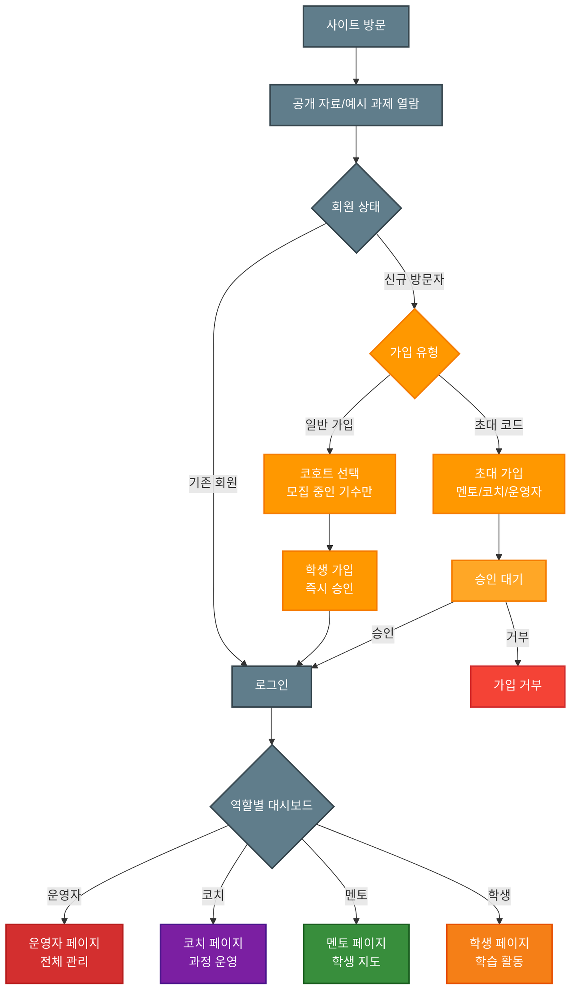
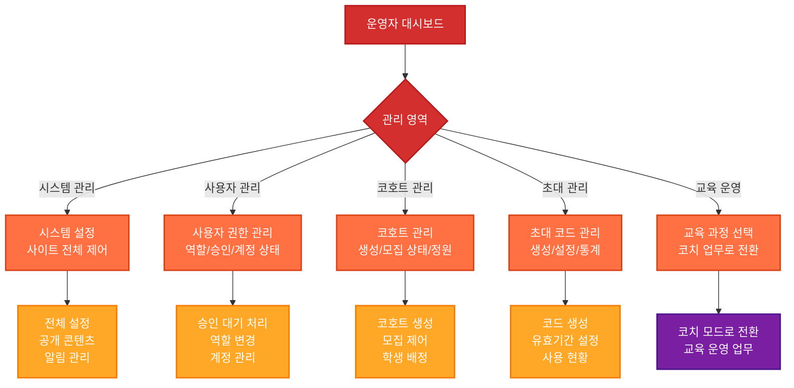
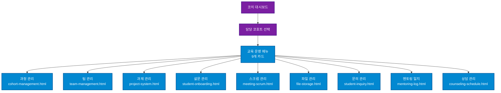
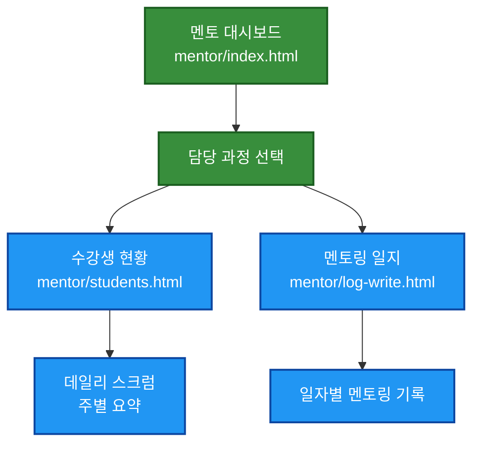
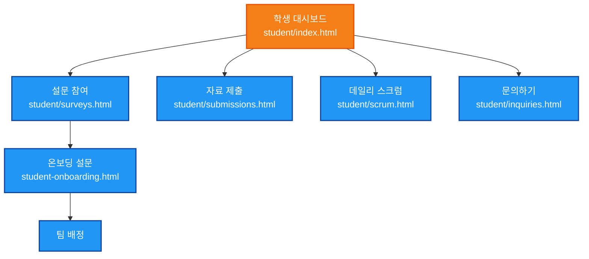
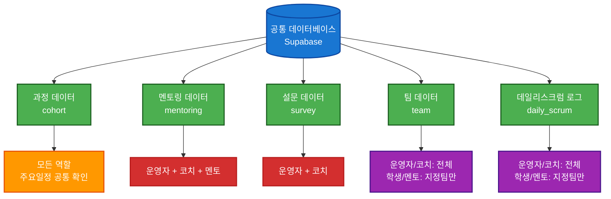

# AI-X 교육과정 통합 운영 시스템 플로우

## 시스템 접근 플로우

```mermaid
flowchart TD
    START[사이트 방문] --> BROWSE[공개 자료/예시 과제 열람]
    BROWSE --> AUTH{회원 상태}
    
    AUTH -->|기존 회원| LOGIN[로그인]
    AUTH -->|신규 방문자| SIGNUP_TYPE{가입 유형}
    
    SIGNUP_TYPE -->|일반 가입| COHORT_SELECT[코호트 선택<br/>모집 중인 기수만]
    SIGNUP_TYPE -->|초대 코드| INVITE_REG[초대 가입<br/>멘토/코치/운영자]
    
    COHORT_SELECT --> STUDENT_REG[학생 가입<br/>즉시 승인]
    STUDENT_REG --> LOGIN
    INVITE_REG --> PENDING[승인 대기]
    PENDING -->|승인| LOGIN
    PENDING -->|거부| REJECT[가입 거부]
    
    LOGIN --> DASHBOARD{역할별 대시보드}
    
    DASHBOARD -->|운영자| ADMIN[운영자 페이지<br/>전체 관리]
    DASHBOARD -->|코치| COACH[코치 페이지<br/>과정 운영]
    DASHBOARD -->|멘토| MENTOR[멘토 페이지<br/>학생 지도]
    DASHBOARD -->|학생| STUDENT[학생 페이지<br/>학습 활동]
    
    classDef start fill:#607d8b,stroke:#37474f,stroke-width:2px,color:#ffffff
    classDef signup fill:#ff9800,stroke:#f57c00,stroke-width:2px,color:#ffffff
    classDef pending fill:#ffa726,stroke:#f57c00,stroke-width:2px,color:#ffffff
    classDef reject fill:#f44336,stroke:#d32f2f,stroke-width:2px,color:#ffffff
    classDef admin fill:#d32f2f,stroke:#b71c1c,stroke-width:2px,color:#ffffff
    classDef coach fill:#7b1fa2,stroke:#4a148c,stroke-width:2px,color:#ffffff
    classDef mentor fill:#388e3c,stroke:#1b5e20,stroke-width:2px,color:#ffffff
    classDef student fill:#f57f17,stroke:#e65100,stroke-width:2px,color:#ffffff
    
    class START,BROWSE,AUTH,LOGIN,DASHBOARD start
    class SIGNUP_TYPE,COHORT_SELECT,STUDENT_REG,INVITE_REG signup
    class PENDING pending
    class REJECT reject
    class ADMIN admin
    class COACH coach
    class MENTOR mentor
    class STUDENT student
```

## 운영자 관리 플로우

```mermaid
flowchart TD
    ADMIN_DASH[운영자 대시보드] --> ADMIN_MENU{관리 영역}
    
    ADMIN_MENU -->|시스템 관리| SYS_MGMT[시스템 설정<br/>사이트 전체 제어]
    ADMIN_MENU -->|사용자 관리| USER_MGMT[사용자 권한 관리<br/>역할/승인/계정 상태]
    ADMIN_MENU -->|코호트 관리| COHORT_MGMT[코호트 관리<br/>생성/모집 상태/정원]
    ADMIN_MENU -->|초대 관리| INVITE_MGMT[초대 코드 관리<br/>생성/설정/통계]
    ADMIN_MENU -->|교육 운영| EDU_MGMT[교육 과정 선택<br/>코치 업무로 전환]
    
    SYS_MGMT --> SYS_SETTING[전체 설정<br/>공개 콘텐츠<br/>알림 관리]
    USER_MGMT --> USER_APPROVAL[승인 대기 처리<br/>역할 변경<br/>계정 관리]
    COHORT_MGMT --> COHORT_SETTING[코호트 생성<br/>모집 제어<br/>학생 배정]
    INVITE_MGMT --> INVITE_SETTING[코드 생성<br/>유효기간 설정<br/>사용 현황]
    
    EDU_MGMT --> COACH_FLOW[코치 모드로 전환<br/>교육 운영 업무]
    
    classDef admin fill:#d32f2f,stroke:#b71c1c,stroke-width:2px,color:#ffffff
    classDef mgmt fill:#ff7043,stroke:#d84315,stroke-width:2px,color:#ffffff
    classDef setting fill:#ffa726,stroke:#f57c00,stroke-width:2px,color:#ffffff
    classDef coach fill:#7b1fa2,stroke:#4a148c,stroke-width:2px,color:#ffffff
    
    class ADMIN_DASH,ADMIN_MENU admin
    class SYS_MGMT,USER_MGMT,COHORT_MGMT,INVITE_MGMT,EDU_MGMT mgmt
    class SYS_SETTING,USER_APPROVAL,COHORT_SETTING,INVITE_SETTING setting
    class COACH_FLOW coach
```

## 코치 교육 운영 플로우

```mermaid
flowchart TD
    COACH_DASH[코치 대시보드] --> COHORT_SELECT[담당 코호트 선택]
    
    COHORT_SELECT --> COACH_MENU[교육 운영 메뉴<br/>9개 카드]
    
    COACH_MENU --> CARD1[과정 관리<br/>cohort-management.html]
    COACH_MENU --> CARD2[팀 관리<br/>team-management.html]
    COACH_MENU --> CARD3[과제 관리<br/>project-system.html]
    COACH_MENU --> CARD4[설문 관리<br/>student-onboarding.html]
    COACH_MENU --> CARD5[스크럼 관리<br/>meeting-scrum.html]
    COACH_MENU --> CARD6[파일 관리<br/>file-storage.html]
    COACH_MENU --> CARD7[문의 관리<br/>student-inquiry.html]
    COACH_MENU --> CARD8[멘토링 일지<br/>mentoring-log.html]
    COACH_MENU --> CARD9[상담 관리<br/>counseling-schedule.html]
    
    classDef coach fill:#7b1fa2,stroke:#4a148c,stroke-width:2px,color:#ffffff
    classDef edu fill:#0288d1,stroke:#01579b,stroke-width:2px,color:#ffffff
    
    class COACH_DASH,COHORT_SELECT coach
    class COACH_MENU,CARD1,CARD2,CARD3,CARD4,CARD5,CARD6,CARD7,CARD8,CARD9 edu
```

## 멘토 플로우

```mermaid
flowchart TD
    MENTOR_START[멘토 대시보드<br/>mentor/index.html] --> COURSE_SELECT[담당 과정 선택]
    
    COURSE_SELECT --> STUDENTS[수강생 현황<br/>mentor/students.html]
    COURSE_SELECT --> LOG[멘토링 일지<br/>mentor/log-write.html]
    
    STUDENTS --> SCRUM_DATA[데일리 스크럼<br/>주별 요약]
    LOG --> DAILY_LOG[일자별 멘토링 기록]
    
    classDef mentor fill:#388e3c,stroke:#1b5e20,stroke-width:2px,color:#ffffff
    classDef data fill:#2196f3,stroke:#0d47a1,stroke-width:2px,color:#ffffff
    
    class MENTOR_START,COURSE_SELECT mentor
    class STUDENTS,LOG,SCRUM_DATA,DAILY_LOG data
```

## 학생 플로우

```mermaid
flowchart TD
    STUDENT_START[학생 대시보드<br/>student/index.html] --> SURVEY[설문 참여<br/>student/surveys.html]
    STUDENT_START --> SUBMIT[자료 제출<br/>student/submissions.html]
    STUDENT_START --> SCRUM[데일리 스크럼<br/>student/scrum.html]
    STUDENT_START --> INQUIRY[문의하기<br/>student/inquiries.html]
    
    SURVEY --> ONBOARD[온보딩 설문<br/>student-onboarding.html]
    ONBOARD --> TEAM_ASSIGN[팀 배정]
    
    classDef student fill:#f57f17,stroke:#e65100,stroke-width:2px,color:#ffffff
    classDef activity fill:#2196f3,stroke:#0d47a1,stroke-width:2px,color:#ffffff
    
    class STUDENT_START student
    class SURVEY,SUBMIT,SCRUM,INQUIRY,ONBOARD,TEAM_ASSIGN activity
```

## 데이터 공통 사용 구조

```mermaid
flowchart TD
    DB[(공통 데이터베이스<br/>Supabase)] --> COHORT[과정 데이터<br/>cohort]
    DB --> MENTORING[멘토링 데이터<br/>mentoring]
    DB --> SURVEY[설문 데이터<br/>survey]
    DB --> TEAM[팀 데이터<br/>team]
    DB --> SCRUM[데일리스크럼 로그<br/>daily_scrum]
    
    COHORT --> ALL[모든 역할<br/>주요일정 공통 확인]
    MENTORING --> ADMIN_COACH_MENTOR[운영자 + 코치 + 멘토]
    SURVEY --> ADMIN_COACH[운영자 + 코치]
    TEAM --> ADMIN_COACH_ALL[운영자/코치: 전체<br/>학생/멘토: 지정팀만]
    SCRUM --> ADMIN_COACH_ALL2[운영자/코치: 전체<br/>학생/멘토: 지정팀만]
    
    classDef db fill:#1976d2,stroke:#0d47a1,stroke-width:2px,color:#ffffff
    classDef data fill:#4caf50,stroke:#1b5e20,stroke-width:2px,color:#ffffff
    classDef all fill:#ff9800,stroke:#e65100,stroke-width:2px,color:#ffffff
    classDef limited fill:#9c27b0,stroke:#4a148c,stroke-width:2px,color:#ffffff
    classDef admin_coach fill:#d32f2f,stroke:#b71c1c,stroke-width:2px,color:#ffffff
    
    class DB db
    class COHORT,MENTORING,SURVEY,TEAM,SCRUM data
    class ALL all
    class ADMIN_COACH_ALL,ADMIN_COACH_ALL2 limited
    class ADMIN_COACH,ADMIN_COACH_MENTOR admin_coach
```