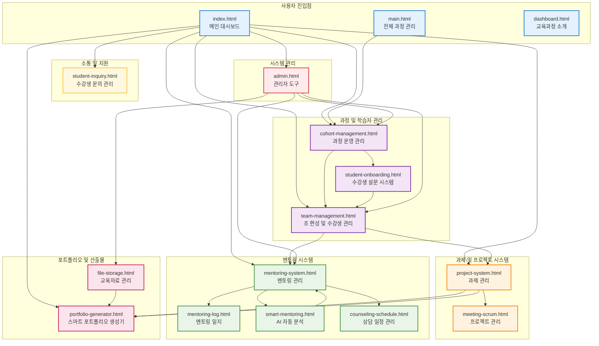
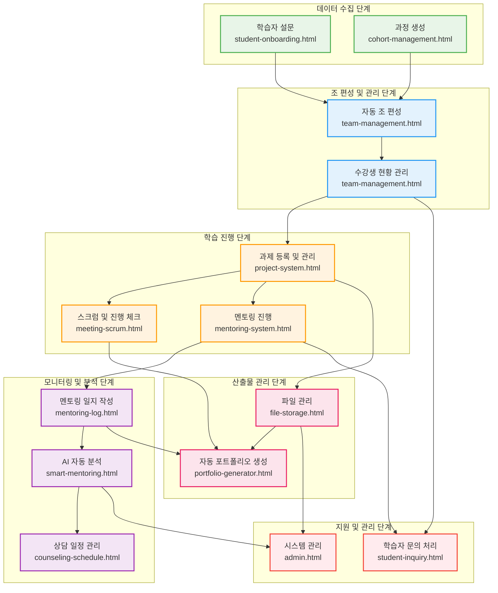

# AI-X 통합 운영 시스템 아키텍처 문서

## 📋 프로젝트 개요
AI-X 교육과정의 통합 운영 관리 시스템 - 운영진, 코치, 멘토를 위한 교육과정 관리 플랫폼

이 시스템은 **18개의 HTML 페이지**로 구성되어 있으며, 교육과정 운영의 모든 단계를 체계적으로 관리할 수 있는 통합 플랫폼입니다.

## 🏗️ 시스템 모듈 아키텍처

### 전체 시스템 구조도

## 🔄 데이터 플로우 아키텍처

### 시스템 프로세스 흐름도

## 👥 사용자 권한 및 역할 아키텍처

### 권한 기반 접근 제어 시스템

```mermaid
graph TB
    %% 사용자 역할
    subgraph "사용자 역할"
        U1[운영자<br/>권회은]
        U2[코치/멘토]
        U3[수강생]
    end
    
    %% 운영자 전용 기능
    subgraph "운영자 전용 기능"
        A1[admin.html<br/>시스템 관리]
        A2[cohort-management.html<br/>과정 관리]
        A3[team-management.html<br/>조 편성 관리]
        A4[file-storage.html<br/>파일 시스템 관리]
    end
    
    %% 코치/멘토 주요 기능
    subgraph "코치/멘토 기능"
        M1[mentoring-system.html<br/>멘토링 관리]
        M2[mentoring-log.html<br/>멘토링 일지]
        M3[smart-mentoring.html<br/>AI 분석 도구]
        M4[counseling-schedule.html<br/>상담 스케줄]
        M5[project-system.html<br/>과제 관리]
        M6[meeting-scrum.html<br/>프로젝트 진행 관리]
    end
    
    %% 공통 기능
    subgraph "공통 기능"
        C1[index.html<br/>메인 대시보드]
        C2[dashboard.html<br/>교육과정 정보]
        C3[portfolio-generator.html<br/>포트폴리오 생성]
        C4[student-inquiry.html<br/>문의 시스템]
    end
    
    %% 수강생 제한 기능
    subgraph "수강생 접근 가능"
        S1[student-onboarding.html<br/>설문 참여]
        S2[포트폴리오 조회]
        S3[과제 제출]
        S4[문의 등록]
    end
    
    %% 권한 연결
    U1 --> A1
    U1 --> A2
    U1 --> A3
    U1 --> A4
    U1 --> M1
    U1 --> M2
    U1 --> M3
    U1 --> M4
    U1 --> M5
    U1 --> M6
    U1 --> C1
    U1 --> C2
    U1 --> C3
    U1 --> C4
    
    U2 --> M1
    U2 --> M2
    U2 --> M3
    U2 --> M4
    U2 --> M5
    U2 --> M6
    U2 --> C1
    U2 --> C2
    U2 --> C3
    U2 --> C4
    
    U3 --> S1
    U3 --> S2
    U3 --> S3
    U3 --> S4
    U3 --> C2
    
    %% 데이터 흐름
    S1 --> A3
    S3 --> M5
    S4 --> C4
    M6 --> C3
    M5 --> C3
    
    %% 스타일링
    classDef admin fill:#ffcdd2,stroke:#d32f2f,stroke-width:3px
    classDef mentor fill:#c8e6c9,stroke:#388e3c,stroke-width:2px
    classDef common fill:#e1f5fe,stroke:#0288d1,stroke-width:2px
    classDef student fill:#fff9c4,stroke:#f57f17,stroke-width:2px
    classDef user fill:#f3e5f5,stroke:#7b1fa2,stroke-width:3px
    
    class A1,A2,A3,A4 admin
    class M1,M2,M3,M4,M5,M6 mentor
    class C1,C2,C3,C4 common
    class S1,S2,S3,S4 student
    class U1,U2,U3 user
```

## 📁 핵심 모듈 구조

### 1. 진입점 및 네비게이션
| 파일명 | 역할 | 주요 기능 |
|--------|------|-----------|
| `index.html` | 메인 대시보드 | 시스템 전체 개요, 핵심 기능 접근 |
| `main.html` | 전체 과정 관리 | 과정별 전환, 아카이브 관리 |
| `dashboard.html` | 교육과정 소개 | 온보딩, 과정 안내 |

### 2. 과정 및 학습자 관리
| 파일명 | 역할 | 주요 기능 |
|--------|------|-----------|
| `cohort-management.html` | 과정 운영 관리 | 과정 생성, 진행률 모니터링, 아카이브 |
| `team-management.html` | 조 편성 및 수강생 관리 | 자동/수동 조 편성, 출석 관리 |
| `student-onboarding.html` | 수강생 설문 시스템 | 팀 편성용 정보 수집, 설문 관리 |

### 3. 과제 및 프로젝트 시스템
| 파일명 | 역할 | 주요 기능 |
|--------|------|-----------|
| `project-system.html` | 과제 관리 | 과제 등록, 제출 현황, 채점 관리 |
| `meeting-scrum.html` | 프로젝트 관리 | 데일리 체크인, 운영 회의, 진행 점검 |

### 4. 멘토링 시스템
| 파일명 | 역할 | 주요 기능 |
|--------|------|-----------|
| `mentoring-system.html` | 멘토링 관리 | 멘토 배정, 일지 관리, 학습자 추적 |
| `mentoring-log.html` | 멘토링 일지 | 조별 멘토링 기록, 진행 상황 관리 |
| `smart-mentoring.html` | AI 자동 분석 | 멘토링 패턴 분석, 위험 학습자 감지 |
| `counseling-schedule.html` | 상담 일정 관리 | 취업 상담, 개별 멘토링 스케줄 |

### 5. 포트폴리오 및 산출물 관리
| 파일명 | 역할 | 주요 기능 |
|--------|------|-----------|
| `portfolio-generator.html` | 스마트 포트폴리오 생성기 | 자동 산출물 수집, 포트폴리오 생성 |
| `file-storage.html` | 교육자료 관리 | 파일 중앙 관리, Google Drive 동기화 |

### 6. 소통 및 지원
| 파일명 | 역할 | 주요 기능 |
|--------|------|-----------|
| `student-inquiry.html` | 수강생 문의 관리 | 학습 문의, 기술 지원, 상담 요청 |

### 7. 시스템 관리
| 파일명 | 역할 | 주요 기능 |
|--------|------|-----------|
| `admin.html` | 관리자 도구 | 시스템 모니터링, 백업, 사용자 권한 관리 |

## 🛠️ 기술 스택

### Frontend
- **HTML5**: 시맨틱 마크업
- **Tailwind CSS**: 유틸리티 퍼스트 CSS 프레임워크
- **Vanilla JavaScript**: 경량화된 인터랙션

### 시각화 & UI
- **Chart.js**: 데이터 차트 및 그래프
- **Heroicons (SVG)**: 일관된 아이콘 시스템
- **Responsive Design**: Mobile-first 접근법

## ✨ 주요 기능 특징

### 🤖 AI 기반 자동화
- **자동 포트폴리오 생성**: 학생 산출물 자동 수집 및 포트폴리오 생성
- **스마트 멘토링 분석**: AI 패턴 분석으로 위험 학습자 조기 감지
- **자동 조 편성**: 알고리즘 기반 최적 팀 구성

### 📊 실시간 모니터링
- **진행률 추적**: 과정별, 개인별 학습 진도 실시간 모니터링
- **알림 시스템**: 긴급 알림, 과제 마감, 멘토링 일지 미작성 알림
- **대시보드**: 통합 현황판으로 전체 시스템 상태 한눈에 파악

### 🔒 권한 기반 보안
- **역할별 접근 제어**: 운영자/코치/수강생별 차등 권한
- **데이터 보호**: 개인정보 및 성적 데이터 보안 관리

### ☁️ 클라우드 연동
- **Google Drive 동기화**: 자동 백업 및 파일 관리
- **백업 시스템**: 시스템 데이터 정기 백업

## 📊 데이터 플로우

### 6단계 프로세스
1. **데이터 수집**: 학습자 설문 및 과정 정보 입력
2. **조 편성**: 자동/수동 팀 구성 및 관리
3. **학습 진행**: 과제 관리, 스크럼, 멘토링 진행
4. **모니터링**: 멘토링 일지, AI 분석, 상담 스케줄 관리
5. **산출물 관리**: 파일 관리 및 자동 포트폴리오 생성
6. **지원 관리**: 문의 처리 및 시스템 관리

## 👥 사용자 권한 체계

### 🔴 운영자 (권회은)
- **전체 시스템 관리 권한**
- 과정 생성/관리, 조 편성, 시스템 설정
- 모든 기능에 대한 읽기/쓰기 권한

### 🟢 코치/멘토
- **멘토링 및 과제 관리 권한**
- 멘토링 기록, 과제 관리, 상담 스케줄 관리
- 담당 학습자에 대한 관리 권한

### 🟡 수강생
- **제한된 조회 및 제출 권한**
- 설문 참여, 과제 제출, 문의 등록
- 개인 포트폴리오 조회

## 📝 파일 명명 규칙

### 구조적 명명
- **기능별 모듈**: `{기능명}-{서브기능}.html`
  - 예: `student-onboarding.html`, `team-management.html`
- **메인 페이지**: `index.html`, `main.html`, `dashboard.html`
- **관리 도구**: `admin.html`
- **테스트 파일**: `test.html`

### 일관성 유지
- 하이픈(`-`)을 사용한 케밥 케이스
- 기능과 역할을 명확히 표현하는 네이밍
- 확장 가능한 구조적 설계

---

## 📋 요약

AI-X 통합 운영 시스템은 **18개의 모듈**로 구성된 교육과정 관리 플랫폼으로, AI 기반 자동화와 실시간 모니터링을 통해 효율적인 교육 운영을 지원합니다. 

**핵심 강점:**
- 🤖 AI 기반 자동 포트폴리오 생성 및 멘토링 분석
- 📊 실시간 진행률 추적 및 대시보드
- 🔒 역할별 권한 관리 시스템
- ☁️ Google Drive 연동 백업 시스템
- 📱 반응형 모바일 퍼스트 디자인

이 시스템을 통해 운영진은 보다 체계적이고 효율적으로 AI-X 교육과정을 관리할 수 있습니다. 