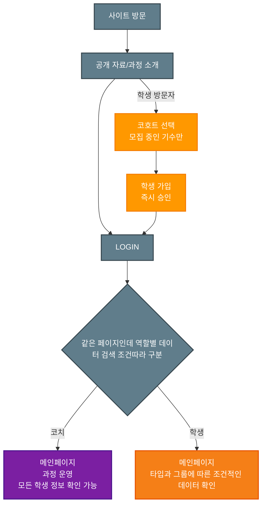
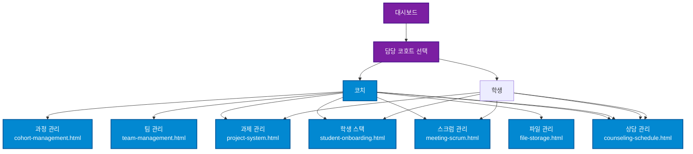
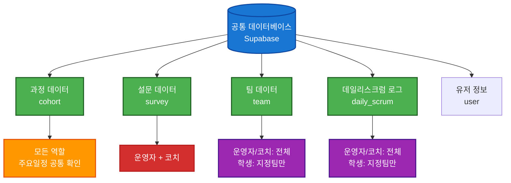

# AI-X 교육과정 통합 운영 시스템 플로우

## 시스템 접근 플로우

```mermaid
flowchart TD
    START[사이트 방문] --> BROWSE[공개 자료/과정 소개]
    BROWSE --> LOGIN --> DASHBOARD{같은 페이지인데 역할별 데이터 검색 조건따라 구분}
    BROWSE --> |학생 방문자| COHORT_SELECT[코호트 선택<br/>모집 중인 기수만]

    DASHBOARD -->|코치| COACH[메인페이지<br/>과정 운영<br/>모든 학생 정보 확인 가능]
    DASHBOARD -->|학생| STUDENT[메인페이지<br/>타입과 그룹에 따른 조건적인 데이터 확인]
    COHORT_SELECT --> STUDENT_REG[학생 가입<br/>즉시 승인]
    STUDENT_REG --> LOGIN

    classDef start fill:#607d8b,stroke:#37474f,stroke-width:2px,color:#ffffff
    classDef signup fill:#ff9800,stroke:#f57c00,stroke-width:2px,color:#ffffff
    classDef pending fill:#ffa726,stroke:#f57c00,stroke-width:2px,color:#ffffff
    classDef reject fill:#f44336,stroke:#d32f2f,stroke-width:2px,color:#ffffff
    classDef admin fill:#d32f2f,stroke:#b71c1c,stroke-width:2px,color:#ffffff
    classDef coach fill:#7b1fa2,stroke:#4a148c,stroke-width:2px,color:#ffffff
    classDef mentor fill:#388e3c,stroke:#1b5e20,stroke-width:2px,color:#ffffff
    classDef student fill:#f57f17,stroke:#e65100,stroke-width:2px,color:#ffffff
    
    class START,BROWSE,AUTH,LOGIN,DASHBOARD start
    class SIGNUP_TYPE,COHORT_SELECT,STUDENT_REG,INVITE_REG signup
    class PENDING pending
    class REJECT reject
    class ADMIN admin
    class COACH coach
    class MENTOR mentor
    class STUDENT student
```

## 교육 운영 플로우

```mermaid
flowchart TD
    COACH_DASH[대시보드] --> COHORT_SELECT[담당 코호트 선택]
    
    COHORT_SELECT --> COACH_MENU[코치]
    COHORT_SELECT --> STUDENT[학생]
    
    COACH_MENU --> CARD1[과정 관리<br/>cohort-management.html]
    COACH_MENU --> CARD2[팀 관리<br/>team-management.html]
    COACH_MENU --> CARD3[과제 관리<br/>project-system.html]
    COACH_MENU --> CARD4[학생 스택<br/>student-onboarding.html]
    COACH_MENU --> CARD5[스크럼 관리<br/>meeting-scrum.html]
    COACH_MENU --> CARD6[파일 관리<br/>file-storage.html]
    COACH_MENU --> CARD9[문의<br/>counseling-schedule.html]
    COACH_MENU --> CARD9[상담 관리<br/>counseling-schedule.html]

    STUDENT --> CARD3[과제 관리<br/>project-system.html]
    STUDENT --> CARD4[학생 스택<br/>student-onboarding.html]
    STUDENT --> CARD5[스크럼 관리<br/>meeting-scrum.html]
    STUDENT --> CARD9[문의<br/>counseling-schedule.html]
    STUDENT --> CARD9[상담 관리<br/>counseling-schedule.html]
    
    classDef coach fill:#7b1fa2,stroke:#4a148c,stroke-width:2px,color:#ffffff
    classDef edu fill:#0288d1,stroke:#01579b,stroke-width:2px,color:#ffffff
    
    class COACH_DASH,COHORT_SELECT coach
    class COACH_MENU,CARD1,CARD2,CARD3,CARD4,CARD5,CARD6,CARD7,CARD8,CARD9 edu
```

## 데이터 공통 사용 구조

```mermaid
flowchart TD
    DB[(공통 데이터베이스<br/>Supabase)] --> COHORT[과정 데이터<br/>cohort]
    DB --> SURVEY[설문 데이터<br/>survey]
    DB --> TEAM[팀 데이터<br/>team]
    DB --> SCRUM[데일리스크럼 로그<br/>daily_scrum]
    DB --> USER[유저 정보<br/>user]
    
    COHORT --> ALL[모든 역할<br/>주요일정 공통 확인]
    SURVEY --> ADMIN_COACH[운영자 + 코치]
    TEAM --> ADMIN_COACH_ALL[운영자/코치: 전체<br/>학생: 지정팀만]
    SCRUM --> ADMIN_COACH_ALL2[운영자/코치: 전체<br/>학생: 지정팀만]
    
    classDef db fill:#1976d2,stroke:#0d47a1,stroke-width:2px,color:#ffffff
    classDef data fill:#4caf50,stroke:#1b5e20,stroke-width:2px,color:#ffffff
    classDef all fill:#ff9800,stroke:#e65100,stroke-width:2px,color:#ffffff
    classDef limited fill:#9c27b0,stroke:#4a148c,stroke-width:2px,color:#ffffff
    classDef admin_coach fill:#d32f2f,stroke:#b71c1c,stroke-width:2px,color:#ffffff
    
    class DB db
    class COHORT,MENTORING,SURVEY,TEAM,SCRUM data
    class ALL all
    class ADMIN_COACH_ALL,ADMIN_COACH_ALL2 limited
    class ADMIN_COACH,ADMIN_COACH_MENTOR admin_coach
```